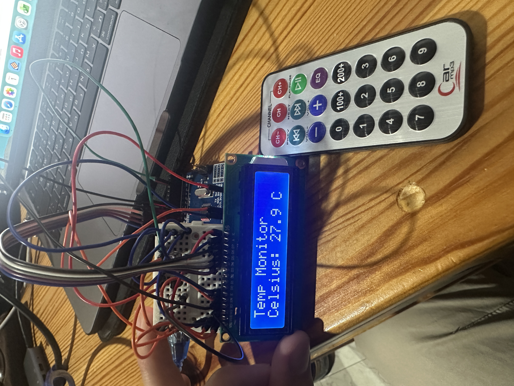

# IR Controlled Temperature Monitor

A compact, remote-controlled ambient temperature monitoring system built with Arduino. This project demonstrates hardware integration, signal decoding, and sensor data filtering.

## 📌 Features
* **IR Signal Decoding:** Utilizes the VS1838B receiver to capture and decode NEC protocol signals from a standard car MP3 remote.
* **Stable Analog Reading:** Implements an oversampling algorithm (averaging 10 readings) to filter out electrical noise from the LM35 temperature sensor.
* **Toggle Display:** The 16x2 LCD can be toggled on and off via the remote to save power and reduce light pollution.

## 🛠️ Hardware Components
* Arduino Uno 
* LM35 Analog Temperature Sensor
* VS1838B Infrared Receiver
* 16x2 LCD Display (Qapass 1602)
* Mini Breadboard & Jumper Wires
* 2kΩ Resistor (for LCD contrast)

## 🔌 Pinout & Wiring

| Component | Pin | Arduino Pin | Notes |
| :--- | :--- | :--- | :--- |
| **VS1838B (IR)** | Signal | D2 | Uses hardware interrupt |
| **LM35 (Temp)** | Vout | A0 | Analog input |
| **LCD 1602** | RS | D7 | |
| **LCD 1602** | E | D12 | |
| **LCD 1602** | D4-D7 | D11, D10, D9, D8 | 4-bit mode |
| **LCD 1602** | V0 | GND | Via 2kΩ resistor for contrast |

##  How to Use
1. Clone this repository.
2. Open the `.ino` file located in the `src` folder using the Arduino IDE.
3. Ensure the `IRremote` and `LiquidCrystal` libraries are installed.
4. Upload the code to your Arduino.
5. Point the remote at the receiver and press the designated button configured and toggle the system.
